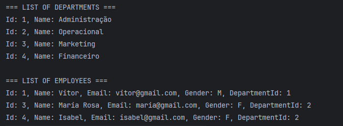
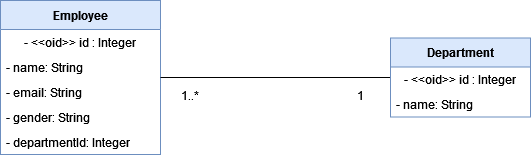

# Gestão de Funcionários e Departamentos


# Sobre o projeto
Projeto criado para praticar as operações básicas de manipulação de banco de dados, utilizando Java e JDBC. Nele, desenvolvi um sistema de gestão para empresas, administrando departamentos e funcionários.

# Funcionalidades

- Operação de Criação, Leitura, Atualização e Deleção de Funcionários e Departamentos.
- Utilização do JDBC para realizar conexão, comunicação e operações entre o Banco de dados e a aplicação.

## 1. Listagem de Funcionários e Departamentos



# Tecnologias utilizadas

## Backend

- Java
- JDBC
- MySQL

# Modelo Conceitual



# Como executar o projeto

Pré-requisitos: Java 17 e MySQLConnector

```bash
# Clone o repositório
    git clone https://github.com/isinhah/funcionario-departamento.git
# Entre na pasta do projeto
    cd funcionario-departamento
# Configure as propriedades do banco de dados
    arquivo db.properties
# Execute o projeto
    class Program
```

# Autor

Isabel Henrique

https://www.linkedin.com/in/isabel-henrique/
